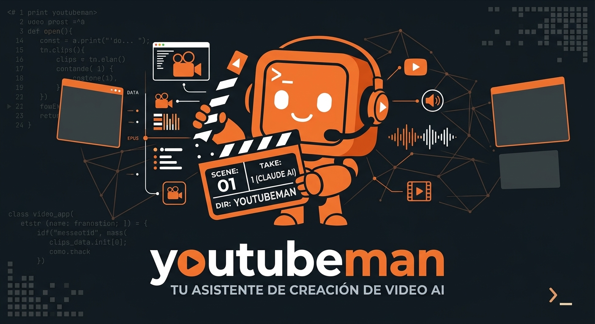

<p align="center">
  
</p>

# youtubeman

> [Versión en español](README.md)

**Launch videos, product demos and social posts, made with code.** Give it your project and youtubeman takes real
screenshots of your product, proposes the story and the style with you, animates every scene and hands you the video
(or the post images) ready to publish.

It is not AI-generated video: every frame is drawn with code. That is why text is always crisp, the interface is your
product's **real** one, and changing something means editing a line and recording again.

> The studio (docs, tools and agent instructions) is written in Spanish. Any modern AI handles it fine, and it can
> talk to you in your language.

https://github.com/user-attachments/assets/244f70cf-bef8-45a0-82eb-c74b77cee147

## What you can ask for

Talk to it normally, like you would to a person. For example:

- **A video of your app or project.** Give it the path to its folder and it looks through it **without touching
  anything**: it takes the logo, colors, texts and real screenshots of your product.

  > `/youtubeman make me a 20-second video of my app. It's in D:\Projects\MyApp`

- **A video of your website.** Give it the address and it takes screenshots of the page itself.

  > `/youtubeman I want a demo of https://mysite.com for Instagram`

- **Copy a style you like.** Give it links to videos on X (or a video file you downloaded) as a reference: it copies
  the pacing, colors and transitions, never the content.

  > `/youtubeman give it the style of this video: https://x.com/user/status/123…`

- **With music.** It finds licensed music and makes every cut land on the beat.
- **For every social network.** Tell it where you will post it (YouTube, X, Reels, TikTok, LinkedIn…) and it prepares
  the right size.
- **Images and carousels.** It also makes a single post image or a carousel for Instagram or LinkedIn.

**How it works with you:** before doing anything it proposes the story and the style, and it stops **4 times** so you
can say "yes" or ask for changes. If you don't like something, say what's wrong and what you want ("at 9 seconds the
price can't be read: make it readable on a phone"). Every version is saved separately (`-v1`, `-v2`…) and the previous
one is never deleted. The finished video appears in `videos/<name>/salida/`.

## What's included

youtubeman is a small video studio with a director and three specialists:

| Piece                   | What it is           | What it does                                                                                 |
| ----------------------- | -------------------- | -------------------------------------------------------------------------------------------- |
| `/youtubeman`           | Skill (the director) | Talks to you, proposes the story and the style, splits the work and stops at each checkpoint |
| `youtubeman-explorador` | Agent (explorer)     | Looks through your repo or site without touching it and prepares the material                |
| `youtubeman-animador`   | Agent (animator)     | Builds and polishes each scene                                                               |
| `youtubeman-critico`    | Agent (critic)       | Reviews the result like a demanding director, scores it and points out the 3 worst problems  |
| Engine and tools        | Code                 | Draw, record and review the videos (`engine/` and `tools/`)                                  |

The skill and the agents are plain-text instructions and come ready inside the folder (`.claude/` and `AGENTS.md`).
They only work with your AI opened inside the youtubeman folder: **nothing is installed in your AI's settings**.

- **Claude Code (recommended):** loads them automatically. Type `/youtubeman`.
- **Another AI (Codex, Cursor, Gemini…):** reads `AGENTS.md`. If it doesn't on its own, tell it "read AGENTS.md".

**100 % local:** no cloud, no API keys, no MCP servers. Internet is only needed to install and, optionally, to fetch a
reference video or look for licensed music.

## Requirements

Everything is required, so the studio behaves the same on every computer:

| Program              | What for                        |
| -------------------- | ------------------------------- |
| Node.js 22 or newer  | Engine and tools                |
| Python 3.11 or newer | Music rhythm analysis (librosa) |
| ffmpeg               | Video encoding and audio mixing |
| git                  | Getting the studio              |

If something is missing:

| System                | Command                                                                   |
| --------------------- | ------------------------------------------------------------------------- |
| Windows               | `winget install OpenJS.NodeJS.LTS Python.Python.3.12 Gyan.FFmpeg Git.Git` |
| macOS                 | `brew install node python ffmpeg git`                                     |
| Linux (Debian/Ubuntu) | `sudo apt install nodejs npm python3 python3-venv ffmpeg git`             |

If you use an AI, it can check and install them for you (with your permission).

## Installation

There are two steps: **download** the studio (git does it) and **install** what it needs (npm does it: libraries,
the screenshot browser and Python to measure the music). This line does both. Paste it into PowerShell (Windows) or
the Terminal (Mac and Linux):

```bash
git clone https://github.com/mabarcodev/YoutubeMan.git youtubeman; cd youtubeman; npm run instalar
```

- `git clone …` downloads the studio into a new folder called `youtubeman`.
- `npm run instalar` installs everything else and ends with a check that tells you if something is missing.

**Using an AI?** Let it do it. Open it in the folder where you want to keep it (for example, Documents) and paste:

> Install youtubeman from https://github.com/mabarcodev/YoutubeMan following its README

It will ask for permission before each step. When it's done, close the AI and open it again **inside** the
`youtubeman` folder.

## Use it

1. Open your AI **inside the `youtubeman` folder**. The first time it will ask whether you trust the folder: say yes.
2. Type `/youtubeman` and what you want (see the examples above). The more specific, the better.
3. Answer its questions and approve each step.

👉 **Step-by-step first video, style references and tips: [docs/GUIDE.en.md](docs/GUIDE.en.md).**

## Approximate usage

A ~30-second video, start to finish, uses roughly **1 to 1.5 million tokens** in Claude Code (explorer, animator and
director). The guide explains how to spend less.

## Tools

The director runs them for you. Run them with `node tools/<tool>.mjs`; all of them have `--ayuda` (help):

| Tool             | What for                                                                   |
| ---------------- | -------------------------------------------------------------------------- |
| `nuevo-proyecto` | Creates a video folder in `videos/` from the templates                     |
| `capturar`       | Real screenshots of a site or app (localhost too), transparent cut-outs    |
| `referencia`     | Frames and contact sheet of a reference video (file, URL or X post)        |
| `medir-audio`    | Effect peaks, BPM, beats and music drop → `AUDIO.json`                     |
| `vista-previa`   | Opens a scene in the browser with a timeline                               |
| `render`         | MP4 in one or more formats, drafts, ranges or PNG stills                   |
| `revisar`        | Contact sheets, mobile check, strips, single-frame jumps and loop check    |
| `doctor`         | Installation diagnostics                                                   |
| `preparar`       | What `npm run instalar` runs: libraries, screenshot browser and Python env |

## Structure

```
.claude/     the /youtubeman skill and the 3 agents' briefs (used from this folder)
AGENTS.md    the same instructions for Codex and other AIs
videos/      your videos, one per folder (ignored by git: never uploaded)
engine/      browser engine: springs, formats, tempo, editing, techniques
tools/       command-line tools (tools/lib: their libraries)
templates/   project, scene and edit templates
ejemplos/    example project ("Ruta", a made-up app): the base the agents follow
REGLAS.md    rules for every video
docs/        GUIA (usage), CONTRATO-ESCENA (engine), RUNBOOK (troubleshooting), adr/ (decisions), img/ (cover)
tests/       unit and integration tests
```

## Contributing

Improvements are welcome: open an issue or a pull request. Before sending:

```bash
npm run lint && npm run format:check && npm test
```

Code conventions: [AGENTS.md](AGENTS.md) · changes: [CHANGELOG.md](CHANGELOG.md) · troubleshooting:
[docs/RUNBOOK.md](docs/RUNBOOK.md).

## License

[MIT](LICENSE). The music, sound effects and fonts used in each project have their own licenses: the explorer
records them in the project inventory.
